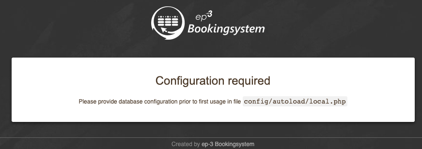

# ep-3 Bookingsystem with direct payment via payum  
fork of 1.7.0 from tkrebs/ep3-bs

modified with payum / payumModule (https://github.com/Payum/PayumModule) for direct payment via paypal and stripe (credit cards, ( apple pay, google pay via PaymentRequest API), SEPA direct debit, iDEAL, Giropay) 

you can combine it with classic behaviour book on billing too

runnnig up to PHP 7.2 - not yet up to 7.4 as the orig project - more updates for modules necessary  

vendor path completely from our instance (tennis-rudolstadt.de) with extended payumModule and payumStripe

css, images (logo) from our instance (to be changed if somebody want's to use this version of ep3-bs)

in addition to the original config there is a projetc.php in config/autoload and the extended local.php for the payment provider options 

in addition to the original project there is a manifest.json, js/sw.js and modified layout.phtml for pwa abbility (use like an app on smartphones) and the hammer.js for swiping left/right in the calendar

for the pwa functionality you must set your "square rules document" in the new extern dir where our hallenordnung.pdf exists - otherwise the handling of the booking is bit blocked when the user wants to read the "square rules" because the pdf is opened in pwa directly and you have no back button or something else   

the layout is a bit modified for better usability on smartphones (even the administration)

in addition to the original project there you can set a membership flag (for tennis club members) for users in the administration and so you can set different prices for members and others incuding vat

in addition to that you can set a time slot for squares in the administration which is reserved for the members of the club - so that only members ca are able to book in that time slot

also you can set a "budget" for activated users in the administration section - maybe 100 Euro - and then the user can book from this budget - this is for selling gift cards or something like that - users can pay a "budget" at the beginning of the winter and then you do not need pay so much to paypal ;-)

we have a door code system provided by a "loxone miniserver" - so there is a little squareControl module integrated -  we generate the door code according to the booking - this functionality can be ativated or deactivated in the config 


# Payment

## paypal
create an account at paypal.com - first sandbox for developing later live - get the NVP/SOAP credentials (username,password,signature) and put them in your config/autoload/local.php

## stripe
create an account at stripe.com - get the API keys (publishable and secret key) - first test later live - and put them in your config/autoload/local.php - enable your preferred payment methods at the stripe dashboard

sepa_debit and other asynchronous payments will remain "pending" status in the app - you have to check manually at the stripe dashboard if the payment is fullfilled - this can happens after a few days - then you can update the booking manually in the app as "paid" - or you can create a webhook at the stripe developer dashboard to your site at https://whatever/public/backend/booking/webhook with events "payment_intent.canceled, payment_intent.payment_failed, payment_intent.succeeded" and then will stripe do it for you

## apple pay via stripe
verify your domain for apple pay

https://stripe.com/docs/stripe-js/elements/payment-request-button#verifying-your-domain-with-apple-pay

## removing unpaid booking try's
cancelling bookings is not allowed in our version - so we remove unpaid user online bookings automatically if they are not completed during the payment process - we remove that bookings after 3 hours (the standard lifetime of a paypal token) in the db with following sql
```
DROP EVENT remove_unpaid_bookings;
SET GLOBAL event_scheduler = ON;
CREATE EVENT remove_unpaid_bookings ON SCHEDULE EVERY 15 MINUTE ON COMPLETION PRESERVE DO delete from bs_bookings where `status` = 'single' and `status_billing` = 'pending' and created < (NOW() - INTERVAL 3 HOUR) and bid in (select bid from bs_bookings_meta where `key` = 'directpay' and `value` = 'true');
```
if a user is actively cancelling the payment via paypal or the stripe checkout - the booking is automatically cancelled too 

## stripe payment site
can be changed via the twig templates of payumStripe - for other language support than German and English you have to extend these templates too

vendor/payum/stripe/Payum/Stripe/Resources/views/Action/stripe_js.html.twig
vendor/payum/stripe/Payum/Stripe/Resources/views/Action/stripe_confirm.html.twig

# dockerization

The dockerization is based on the https://gitlab.kh-berlin.de/hheiss/ep3-bs-docker/-/tree/master but with some changes for our needs. The changes we made are listed below:
- In Dockerfile: 
  - Add ENV COMPOSER_ALLOW_SUPERUSER=1 to give root privileges to install packages and dependencies
  - Remove install/app since we are using our own app folder

- In docker-compose.yml:
  - Use new docker compose syntax
  - Open port 3306 for mysql, which enables local mysql client to connect to the database
  - Only store database data in volumes. Other images like logo not stored in volumes but copy to the container from app folder

- In app/config/global.php and app/config/project.php:
  - Add cookie_name_prefix
  - Make cookie_name_prefix consistent

- In app/config/local.php:
  - Make database username and password consistent
  - Open port 3306 for db
- In app/module/Setup/src/Setup/Controller/Plugin/ValidateSetup.php:
  - Comment out exception to raise 'System has already been setup' error

- Copy data/database_charlotte/payment.sql to data/db/ep3-bs.sql

## How to run

- In root folder, run:
  -  `docker compose build`
  -  `docker compose up -d`
  -  `docker compose stop`: stop the containers
  -  `docker compose down`: stop and remove containers
  
- Open web browser at http://localhost:8080

- It will take a while when first setting up the website, if you see error message 

  at the beginning, wait for a while and refresh the page.

- The commit history cannot be maintained in github, using `git log --follow filepath` to check full history

